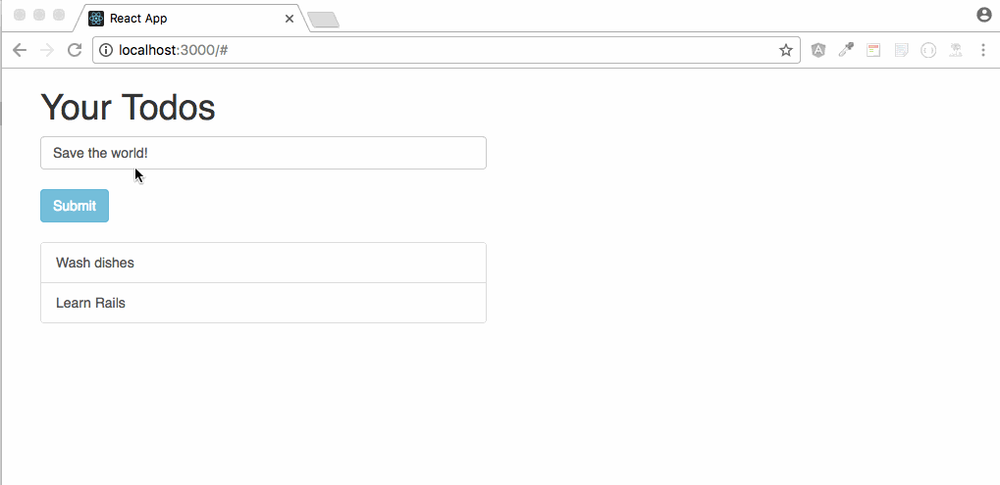
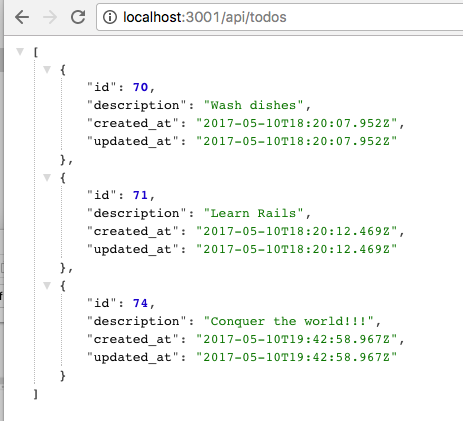

I recently created a simple todo app using React and Rails.

The app itself is pretty simple. What is special about this app compared to other apps I have done in the past, is that the app is running on two different projects: [rerails-api](https://github.com/IggHub/rerails-api) and [rerails-client](https://github.com/IggHub/rerails-client).

The API side is a simple rails app that does basic CRD Todos methods (Create, Read, and Delete). It serves as a database and provides an API outlet for React at localhost:3001

The Client side is a simple React app that is proxied to specific address (localhost:3001) to get its data from. It is running on localhost:3000.

It was possible thanks for [foreman gem](https://github.com/ddollar/foreman) to run multiple servers simultaneously.

To check how it is done, feel free to check out the README on both repos:

- [Client](https://github.com/IggHub/rerails-client)
- [API](https://github.com/IggHub/rerails-api)

Let me know if you have any questions!
